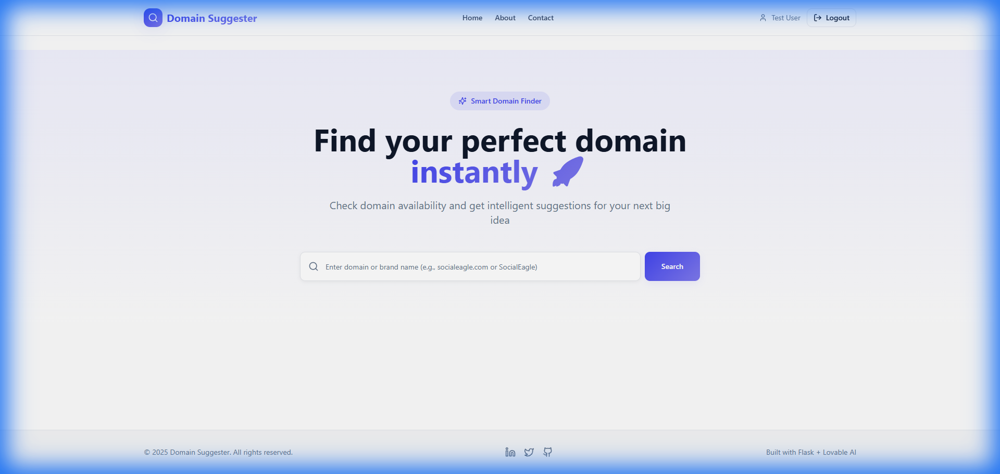
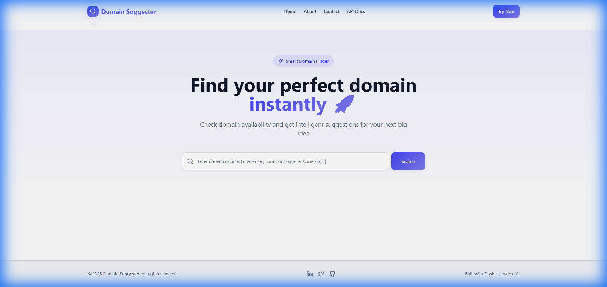

# 🌐 Domain Suggester

A full-stack web application for checking domain availability and generating creative domain name suggestions. Features user authentication with Google Sign-In support.

## � Screenshots

### Home Page (After Login)


### Search Interface


## �📁 Project Structure

```
vibe-coding/
├── .env                    # Single environment file (all config)
├── .env.example            # Template for .env
├── README.md               # This file
│
├── frontend/               # React/Vite Frontend
│   ├── src/               # Source code
│   │   ├── features/      # Feature modules (auth, domain, etc.)
│   │   ├── services/      # API services
│   │   ├── components/    # UI components
│   │   └── pages/         # Page components
│   ├── package.json       # Node dependencies
│   └── vite.config.ts     # Vite configuration
│
└── backend/                # Flask API Server
    ├── app.py             # Entry point
    ├── config.py          # Configuration
    ├── routes/            # API endpoints
    ├── services/          # Business logic
    └── models/            # Database models
```

## 🚀 Quick Start

### 1. Setup Environment
Copy `.env.example` to `.env` and fill in your values:
```bash
cp .env.example .env
```

### 2. Run Frontend
```bash
cd frontend
npm install
npm run dev
```
Opens at http://localhost:8080

### 3. Run Backend
```bash
cd backend
python -m venv .venv
.venv\Scripts\activate
pip install -r requirements.txt
python app.py
```
Runs at http://localhost:5000

## 🔑 Environment Variables (.env)

| Variable | Description |
|----------|-------------|
| `VITE_API_URL` | Backend API URL |
| `VITE_GOOGLE_CLIENT_ID` | Google OAuth Client ID |
| `WHOIS_API_KEY` | WhoisXML API key |
| `SMTP_*` | Email notification settings |

## ✨ Features

- 🔍 **Domain Search** - Check domain availability in real-time
- 💡 **Smart Suggestions** - Get alternative domain ideas
- 🔐 **User Authentication** - Email/Password + Google Sign-In
- 📧 **Email Notifications** - Get notified when domains become available
- 🎨 **Modern UI** - Built with TailwindCSS and shadcn/ui

## 🛠️ Tech Stack

<<<<<<< HEAD
**Frontend:** React, TypeScript, Vite, TailwindCSS, shadcn/ui  
**Backend:** Python, Flask, SQLite  
**Auth:** Email/Password + Google OAuth
=======
## 💬 Contact
**Author:** [Vinodhan]  
**GitHub:** [@vinodhan07](https://github.com/vinodhan07)  
**Email:** vinovb21@gmail.com

---

### ⭐ If you like this project, consider giving it a star on GitHub!
>>>>>>> 789dffd699f13a7c7b51c08a8872af3f5c9cb30b
